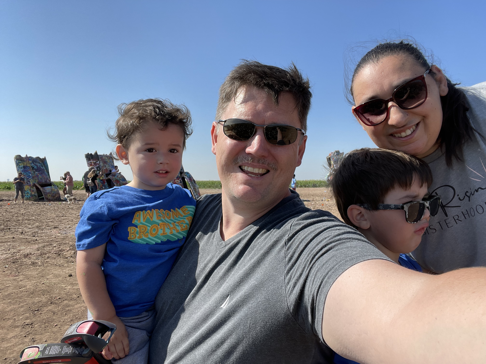
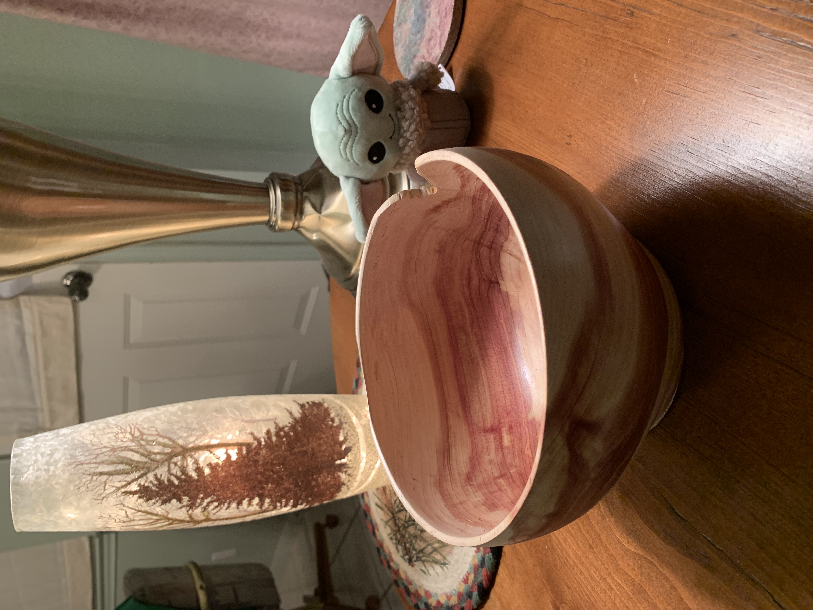

# More about Ryan

## Why this document?

Over the years, I’ve worked with a number of managers. I’ve always found that my relationship with them worked best when I understood how they worked and what they expected of me. This document will hopefully help you get a better understanding of me faster.

## What’s my role as the team manager

At the most fundamental level, my role is to **coordinate** the work that we do as a team. Most of my time will be spent being a traffic cop, making sure that you have everything you need and our customers are getting the help they need.

Alongside coordinating our work, I’m here to make sure you have everything you need to do your job. Whether it’s extra resources, access to various systems, getting clarity on a task, or finding the right person to help with a situation, I’ll make sure you’re **enabled** to do your job.

Strategically, I’ll work to set the **direction** of our team, including our scope of responsibilities, how we can best contribute to the company, and how others in the company can best work with us.

And finally, a key component of my job is to help you **grow** and get to the next step in your career. We’ll talk about where you are currently and where you want to go. I’ll do all I can to help you get to that next step.

## What’s *not* my role as the team manager

Track how you spend your day. At the end of the day, I just want the work to get done. I don’t care how you get it done. As long as you’re getting the work done and are attending all the important meetings, work when and how you want.

Tell you how to do your job. You’re the expert. I’m just here to help you do it. I’ll help you figure things out if you’re struggling.

## What do I value?

Initiative. If you see something that needs done, do it! I won’t ever criticize you for stepping up and trying to fix a problem that you’ve found. Do it well, and follow what policies & processes we’ve set up, and I’ll applaud you, whether it succeeds or fails.

Curiosity. Keep learning. Improve your skills. Gain new abilities. Learn from others. Improve yourself.

Conflict (the healthy kind). The worst team is one that avoids conflict. Instead, be willing to speak up and disagree. Just do it respectfully, and be ok if others speak up about something you’ve said.

## What will disappoint me?

People who put their ego above the team. We’re all trying to advance our careers - that’s part of the human condition. But advancing yourself over the benefit of the team is a quick way to get on my bad side.

Assume bad intent from others. A friend & corporate trainer once said, if you feel somebody’s wronged you it’s much more likely that they didn’t think through their actions than that they actually set out to attack you. Going back to healthy conflict, it’s impossible to have healthy conflict when you assume the other person is out to get you.

## Personal quirks

I’ve been told that I often come across as more passionate or committed to an idea than I really am. If I get excited about something, I can be

I’m a “what you see is what you get” type person. I’m honest with my feelings and opinions. I don’t play politics - never really understood it.

I’m a teacher at heart. That was my first career and it stuck deep inside my brain.

## How to reach me

* Slack first. I’d recommend Slack for just about anything. I respond to most slacks within an hour (I do my best to ignore Slack during meetings)

* Email. I check email a few times a day. It’ll typically take me about 1/2 a day to respond to your email.

* Schedule a meeting. My calendar is always up to date. If you want to talk about *anything*, just grab some extra time on my calendar. Don’t feel like you need to wait for our 1:1.

* Text message or phone call. Don’t be afraid to text or call me, even after hours. Just know, I have spam filtering in front of phone calls because I get 2 or 3 spam calls a day. Leave a message if I don’t answer and I’ll call you back right away. (I may occasionally text you if it’s something important and time-sensitive, but I save this as a last-ditch communication channel)

## Some personal stuff

I’ve got a wife and two little boys. You’ll definitely meet Alex and Ian if you haven’t yet - they love to show off their latest toy or dance move to the people on my zoom calls.

I do woodworking, though not as much as I’d like (remember the two boys?!). And actually I’ve got my desk set up out in the garage / wood shop. During the horrors of 2020, I tried working from literally every room in the house. The garage was the only spot where I wasn’t in the way of the rest of the family, so I ended up setting up out there and we’ve all been much happier ever since.

I don’t have any pets right now, but I’m a dog guy. We had a scottie that died a few years ago and a Golden that died just last year. We just haven’t been ready for a new dog quite yet, but maybe soon.

I watch more movies than I should, especially horror movies. Don’t know why - something about the mystery and the adrenaline rush. I’m a sucker for zombies, vampires, and demons. 30 Days of Night - it’s a masterpiece!# Manager Readme
